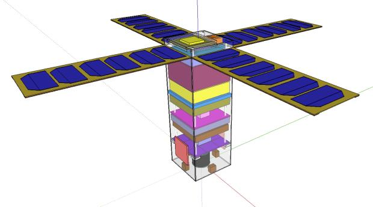

# Introduction

TEST TEST TEST TEST TEST TEST TEST TEST TEST TEST TEST TEST TEST TEST TEST TEST TEST TEST 

Meteorix est un projet qui vise à réaliser un nanosatellite capable de détecter les météores afin de les caractériser. Ce projet est mené par plusieurs instances notamment le LIP6, le CNRS ou encore l’observatoire de Paris. L’idée est de remplacer un nanosatellite de taille normale par plusieurs nanosatellites qui possèdent un coût de fabrication très inférieur et qui permettront d’avoir un meilleur angle de capture, ainsi la qualité des résultats et des interprétations seront meilleures. Un nanosatellite sera envoyé avec une unité de calcul et une caméra dans l’espace. Celui-ci sera limité par une contrainte énergétique de 10W pour tout le fonctionnement du système, c’est-à-dire capture de la vidéo, traitement et envoi des images avec un météore. Un algorithme de détection efficace et satisfaisant la contrainte énergétique est déjà implémenté dans l’unité de calcul mais il fournit des images dont la qualité peut être largement améliorée en utilisant des méthodes modernes. Ce travail d’optimisation nous a été confié et est l’objectif principal de ce projet.

  