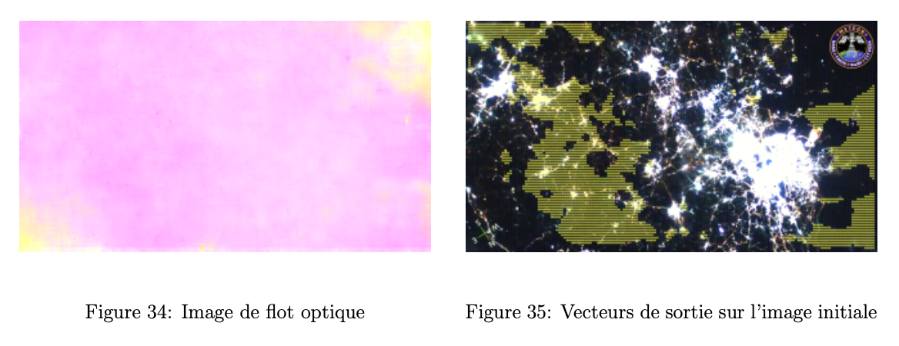
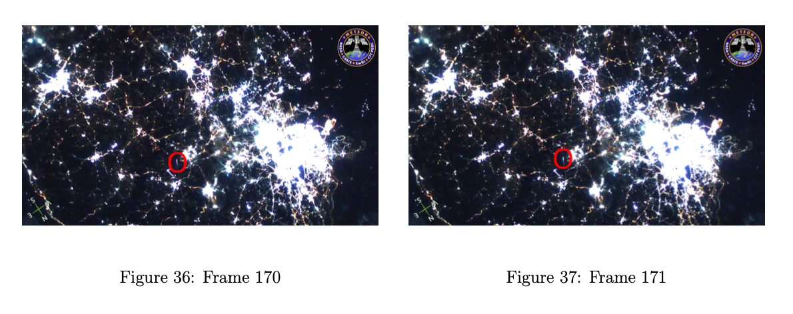
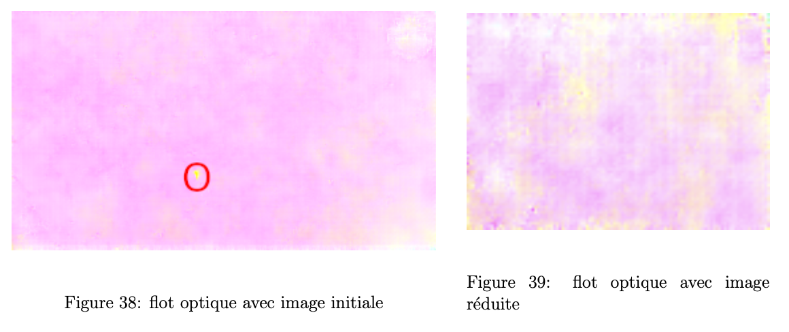
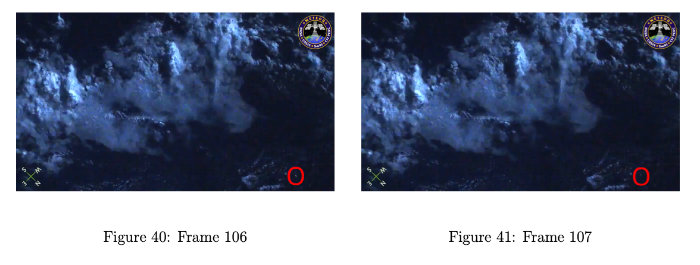
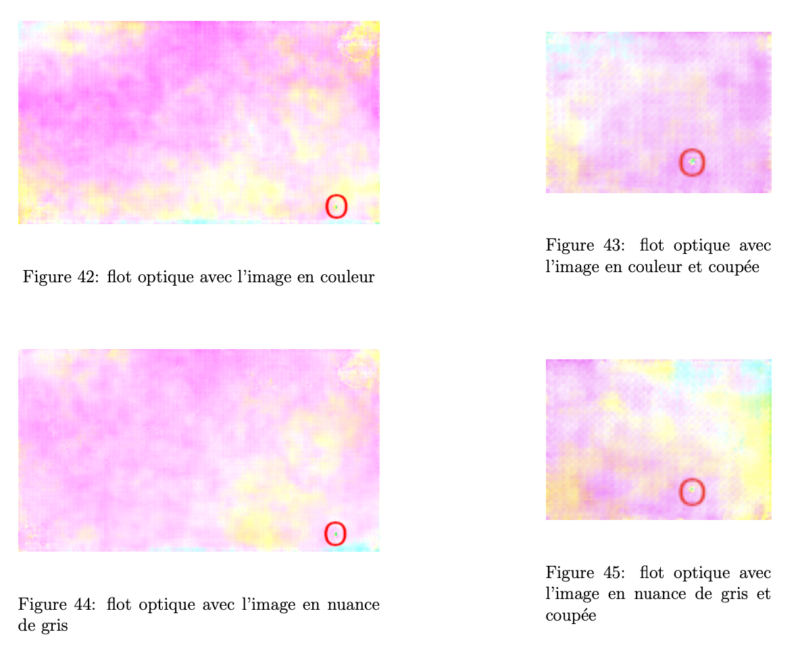

# Inférence de FlowNet

Nous avons récupéré la première version de FlowNet et nous l'avons fait fonctionner sur l'EM780. Puis nous avons dû tester si FlowNet était vraiment pertinent dans le cadre de ce projet. Le défi avec la capture de météore est le fait que le météore est un objet très petit qui peut facilement ne pas être détecté si on prend en compte la qualité moyenne de certaines vidéos (et donc le bruit dans ces images).

## Données testées

Les données que nous avons utilisées ont été fourni par M. Cassagne. Nous avons récupéré des images de vidéo de 30 fps montrant des météores avec un fond de villes ou de nuages, ce qui correspond aux images que pourrait prendre le nanosatellite. Nous avons essayé de modifier les images données au réseau pour voir si cela améliorait les résultats ou non. Les modifications testées ont été :

- d'images de couleur à en nuance de gris (ce qui est pertinent car les images de la caméra du nanosatellite seront en nuance de gris)
- réduction de qualité (l'espacement des pixels étant diminué, le flot optique aurait pu être plus facilement calculé)
- des images coupées sur le météore (le météore étant très petit sur un fond qui "bouge" dans le même sens, le fait de couper l'image sur le météore permet de donner "plus de poids" au mouvement du météore et le crop fait sens vis à vis du travail fourni par le premier axe de ce projet)

Les météores pouvant apparaître que sur quelques frames, nous n'avons pas cherché à regarder le flot optique sur des images avec un fps moins élevé. Finalement, nous donnons au réseau deux images préalablement extraite d'une vidéo, présélectionnée (ou nous pouvons remarquer un météore à l'oeil nu) et peut être modifiée de, soit 1280x720 (la taille originale), soit 480x320 (crop ou réduite). Pour cela nous avons utilisé des commandes de FFMPEG.

## Sorties du réseau

En sortie du réseau de neurones, nous avons une image de taille divisée par quatre (de la taille initiale) ou la couleur des pixels représente l'angle du vecteur de flot optique calculé et l'intensité des couleurs représente la norme du vecteur. Nous pouvons aussi avoir en sortie des fichier npy qui donnent des matrices (numpy) avec le flot optique directement. Des options sont possible dans le code de FlowNet pour n'avoir accès qu'à un type de sortie ou pour avoir les deux en même temps. Cette option n'implique pas un coût de calcul supérieur dans chacun des cas.

Ci-dessous un exemple de sortie sur le flot calculée entre la 148ème et la 149ème frame de la vidéo v99.mp4 fournie :

  

## Résultats

### Réduction d'image

Différence entre un flot optique obtenu à partir de deux images réduites ainsi qu'à leur taille initiale sur la vidéo v99.mp4 :

  

  

Ici nous pouvons remarquer très clairement que le flot optique ne capture pas plus facilement le météore avec une image réduite. La raison serait lié à l'entraînement de FlowNet prenant en compte le bruit gaussien pouvant exister entre deux images : dans une vidéo, des pixels peuvent changer très légèrement de couleur ainsi que disparaître ou apparaître. FlowNet a été entraîné pour ne pas prendre en compte ces "erreurs". Le météore étant très petit, la réduction le rend encore plus petit et donc beaucoup moins détectable.

### Coupage et mise en nuance de gris de l'image

Ci-dessous la sortie pour les frames 106 et 107 de la vidéo v03.mp4 avec soit l'image en couleur ou en nuance de gris, soit l'image coupée ou non.

  

  

A l'oeil nu, en format vidéo, la différence entre crop/taille initiale et couleur/nuance de gris est visible. Il faut aussi noter que malgré cela quand le météore n'est pas détectée dans la "pire" version possible (image sans changement), il n'est pas détecté dans les autres versions non plus. Vis à vis des performances, le réseau ne gagne pas de temps en traitant une image en nuance de gris (ce qui pourrait être une piste si le but est d'optimiser ce réseau dans ce projet) mais en gagne énormément en coupant l'image. Ainsi, pour la chaine de traitement après la détermination du flot optique et pour le temps de calcul, il serait préférable de couper l'image (la vidéo étant déjà en nuance de gris).

### Limites des tests

Ci-dessous le flot calculé à partir de la vidéo v02.mp4, une séquence avec des nuages et un météore très peu visible.

  

Cependant, comme montré au-dessus, dans certaines séquences compliquées, nous n'arrivons pas à détecter de météores. Nous avons remarqué que entre des séquences avec en fond une ville contre des séquences avec en fond des nuages, le réseau pouvait plus facilement trouver le météore avec un fond de type "ville". En regardant plus attentivement, cela fait sens du au fait que les pixels des nuages "bourgent" énormément (beaucoup de pixels dans les nuages changent assez brusquement de couleurs alors qu'on peut à l'oeil nu remarquer un mouvement global).

### Conclusion

Les images de flot optique obtenues précédemment représentent, pour certaines, un flot optique assez satisfaisant et pertinent par rapport au mouvement étudié. Nous avons testé la pertinence de certaines modifications sur les images en entrée et avons eu des résultats concluant dessus. Néanmoins, pour d'autres images, certains flots optiques demeurent insatisfaisants. On a vu que cette performance pouvait être fortement liée au choix du modèle entraîné mais aussi au choix de différents paramètres sur la paire d'image à l'entrée comme les différents type de fond des vidéos.

Nous avons aussi mesuré le temps nécessaire pour le calcul du flot optique qui est disponible dans un table en annexe. Ce sont des résultats obtenus sur deux vidéos : v00.mp4 et v02.mp4.

Voyant ces résultats, nous avons conclus que les poids que nous avions n'était pas suffisant pour notre projet. Nous avons donc essayé de commencer à générer un dataset pour un apprentissage plus spécifique à notre problème dans le temps qu'il nous restait.