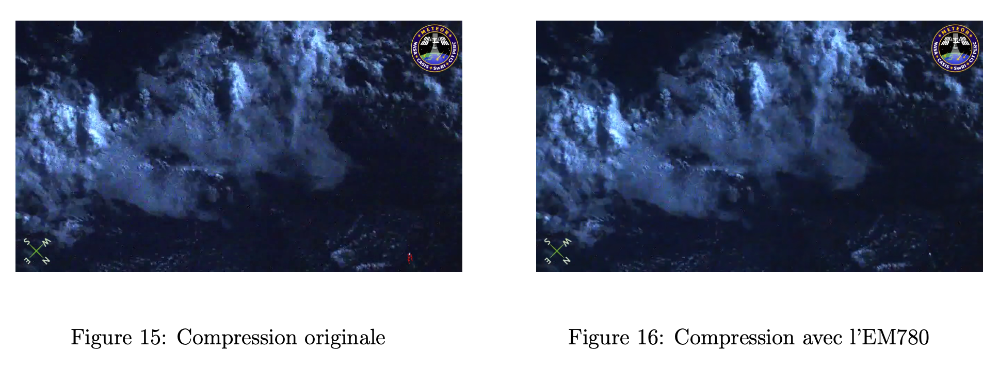
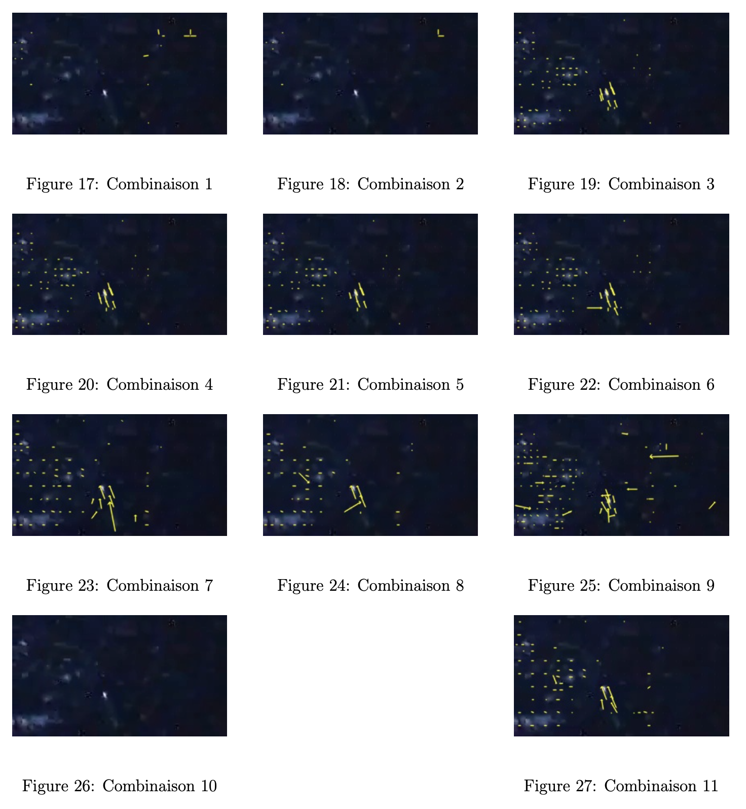
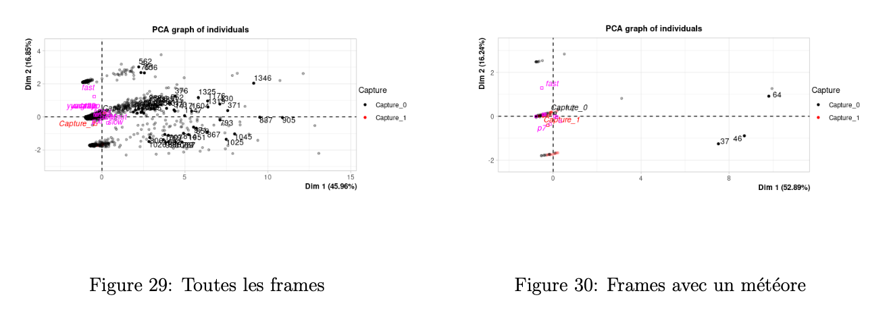
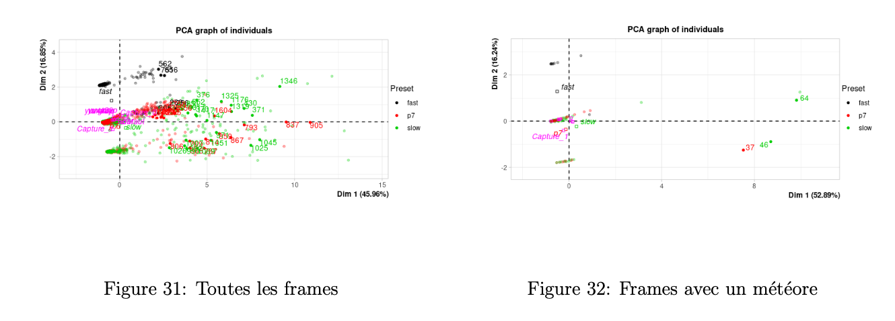

# 4 Paramètres de compression

Dans cette partie nous allons étudier les paramètres de compression pour déterminer la manière la plus efficace de capturer un météore si on applique notre algorithme de filtrage sur une vidéo compressée par l'EM780.

## 4.1 Première approche

Tout d'abord pour lancer Motion Vector Extractor sur l'EM780 nous avons eu l'idée de créer un environnement virtuel Python et ainsi installer les bibliothèques nécessaires au script.

Comme première approche nous allons lancer notre algorithme sur une vidéo compressée avec les paramètres par défaut sur l'EM780 et comparer les vecteurs que l'on obtient avec celle que notre machine personnelle a extraite.

  

Nous remarquons que notre algorithme a réussi à capturer le météore sur notre PC au contraire de l'EM780. Les filtres appliqués sont peut être trop forts, ou l'image est simplement compressée différemment.

## 4.2 Protocole expérimental

Nous avons vu qu'en encodant la vidéo avec le GPU sur l'EM780 les vecteurs vitesse trouvés n'étaient pas bons. Nous allons donc essayer de jouer sur les paramètres d'encodage pour obtenir un résultat satisfaisant.

Nous pouvons modifier :

- Le mode d'encodage, on peut encoder en H.264 ou H.265
- Le framerate, soit le nombre d'image par seconde (par défaut, 25)
- Le preset, plus le preset est faible, plus la compression prendra du temps mais la qualité de l'image sera moins dégradée
- La fréquence des images clés (par défaut, framerate*10)
- Le bitrate, on peut choisir un bitrate fixe ou alors variable qui adapte la compression en donnant plus de bits en partie en mouvements

Nous allons suivre le déroulé suivant :

1. On commence par compresser les images avec les commandes décrites dans 4.3
2. On lance Motion Vector Extractor sur chaque vidéo
3. On transfère les données obtenues sur notre PC afin de les analyser

## 4.3 Commandes expérimentales

| Numéro | Framerate | Preset | Images clés | Bitrate | Encodage |
|---|---|---|---|---|---|
| 1    | 30    | fast    | 300    | fixe    | H.264    |
| 2    | 30    | fast    | 10    | fixe    | H.264    |
| 3    | 30    | slow    | 10    | fixe    | H.264    |
| 4    | 30    | slow    | 5    | fixe    | H.264    |
| 5    | 25    | slow    | 10    | fixe    | H.264    |
| 6    | 25    | p7    | 10    | fixe    | H.264    |
| 7    | 30    | p7    | 10    | variable   | H.264    |
| 8    | 30    | p7    | 10    | variable   | H.264    |
| 9    | 30    | slow    | 15    | fixe    | H.264    |
| 10    | 30    | slow    | 10    | fixe    | H.265    |
| 11    | 30    | p7    | 10    | fixe    | H.264    |

*Table 1: Commandes de compression*

## 4.4 Analyse

Nous allons regarder quelles sont les combinaisons de paramètres qui capturent au mieux un météore.

### 4.4.1 Analyse visuelle

Les images suivantes sont celles où le météore a été le mieux attrapé en utilisant les paramètres du tableau ci-dessus. Sur les images la tache blanche est le météore et les vecteurs sont issus de la compression. La première remarque que l'on peut faire est que l'encodage H.265 n'est pas supporté (Combinaison 10). Ensuite il ne faut pas laisser un nombre trop faible d'images clés sous peine de ne même pas capturer le météore (Combinaison 1).

En revanche il est difficile de déterminer quelle est la meilleure combinaison, c'est pourquoi nous allons faire une analyse de composantes principales pour essayer d'y répondre.

  

### 4.4.2 Analyse de composantes principales

L'analyse en composantes principales (ACP) est une méthode statistique permettant de réduire la dimensionnalité d'un jeu de données tout en conservant l'essentiel de l'information. Elle transforme un ensemble de variables corrélées en un nouveau système de variables non corrélées, appelées composantes principales, ordonnées selon la variance expliquée.

Dans le cadre de l'optimisation des paramètres de compression pour la détection de météores en vidéo, l'ACP va nous permettre d'identifier les facteurs influençant le mieux la qualité de détection. Ainsi, l'ACP constitue un outil pertinent pour sélectionner les configurations de compression optimales.

Dans un premier temps, nous avons collecté les données de chaque frame tel que la moyenne des composantes x et y des vecteurs, la norme ainsi que l'écart type des composantes x et y. Nous associons à chaque frame les paramètres de compression utilisés ainsi qu'un facteur indiquant si le météore a été capturé (1) ou non (0).

Pour cela on utilise l'analyse visuelle pour savoir s'il y a suffisamment de vecteurs sur le météore pour dire s'il a bien été attrapé.

Enfin, nous lançons l'ACP en utilisant le package FactoMineR de R qui permet de centrer et réduire les données afin qu'elles aient toutes la même échelle.

  
*Figure 28: Cercle des corrélations*

La première remarque que l'on peut faire est que les deux premières composantes principales expliquent 60 % de l'inertie du jeu de données, ce qui signifie que ces deux axes capturent 60 % de la variance totale des données. Cela permet de réduire la dimensionnalité du jeu de données tout en préservant une part significative de l'information.

Ensuite, le premier axe oppose les images avec un vecteur de norme et d'écart type élevé aux images de norme faible ou négative et d'écart type nul. Le second axe, quant à lui, oppose les images d'une vidéo compressée avec peu d'images clés et un framerate élevé avec son inverse.

Maintenant passons à la représentation des individus dans le premier plan principal. Nous allons uniquement présenter les résultats intéressants.

  

Le graphique de gauche représente toutes les images tandis que celui de droite est restreint aux images avec un météore dessus. D'après les deux figures, il y a clairement deux zones où des météores sont capturés (point rouge), pour les deux c'est des images avec une norme et un écart type nuls. De plus la fréquence des images clés doit se situer vers les 10.

  

En coloriant en fonction du preset, on en déduit que seuls les presets slow et p7 permettent de capturer le météore. En revanche, nous manquons de données pour ressortir d'autres résultats pour définir le rôle des autres paramètres.